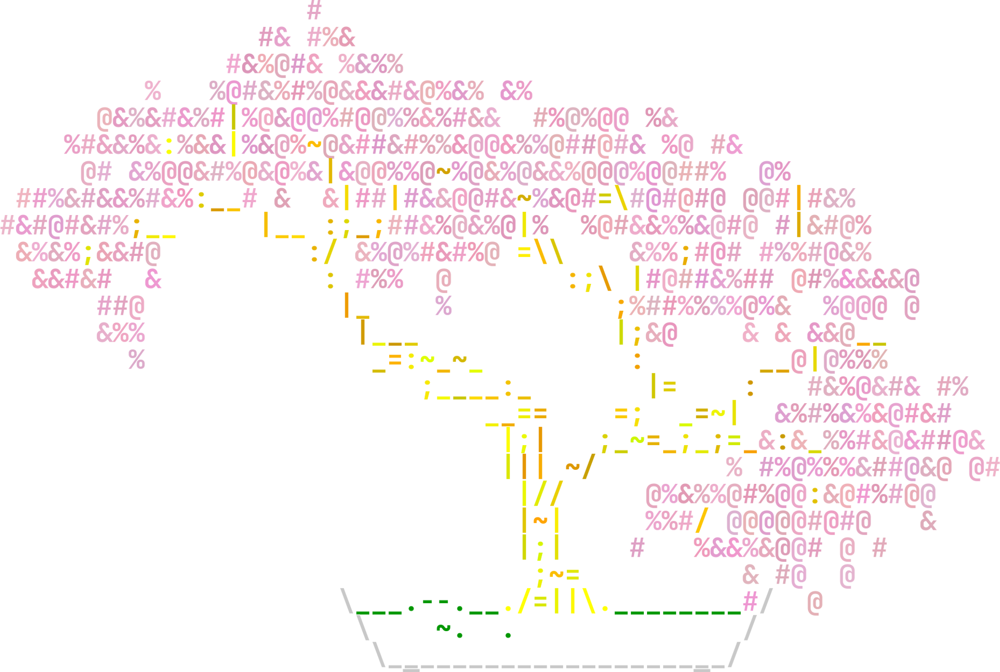

<div align="center">
  
</div>

<p align="center">
  
</p>

<!-- # 𝕂𝕪𝕠𝕥𝕠 𝕂𝕪𝕓𝕖𝕣𝕡𝕒𝕟𝕜 🚀

👾 **NKTKLN** - ネットワークの住人 (Resident of the Network)  
**Status**: Online in the Wired  
**Location**: Moscow, Russia  
**Skills**: TypeScript | Python | React | Neural Interfaces -->

### 「 About me 」

>[!NOTE] Quote
>Today's idleness will turn into tears tomorrow.

[](https://github.com/piyushsuthar/github-readme-quotes)

<!-- ```
⌬ Name: NKTKLN
⌬ Status: Online in the Wired
⌬ Skills: TypeScript | Python | React | Neural Interfaces
⌬ Location: Moscow Russia
``` -->

### 「 My Skills 」

#### 🔧 Programming Languages


#### 🛠️ Tools & Technologies


#### 💼 Databases


### 「 Contacts 」

[](https://t.me/NKTKLN)
[](mailto:nktkln@nktkln.com)  

<p align="center">
  
</p>

<p align="center">
  <small>Thank you for visiting! / ご覧いただきありがとうございます 🌸</small>
</p>
