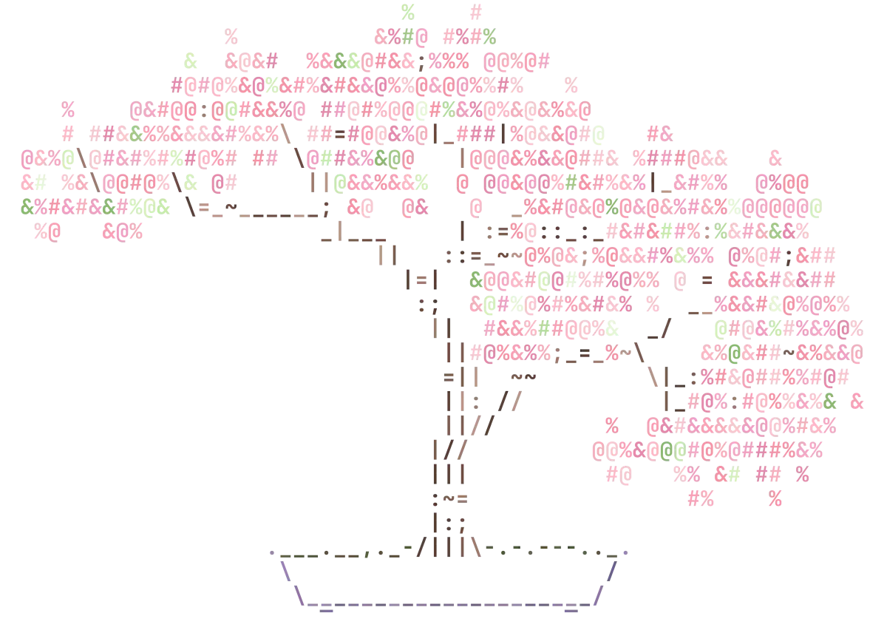

  

  

### 「 About me 」

> «Code is a tool to build the future, one line at a time.»

**⌬ Name**: NKTKLN  
**⌬ Status**: Online in the Wired  
**⌬ Focus**: Working on my projects and learning new technologies  
**⌬ Skills**: Python, Docker, Linux  
**⌬ Location**: Moscow, Russia  

### 「 Contacts 」

- **Telegram**: [@NKTKLN_Work](https://t.me/NKTKLN_Work)
- **Email**: [nktkln@nktkln.com](mailto:nktkln@nktkln.com)

  

Thank you for visiting! 🌸

