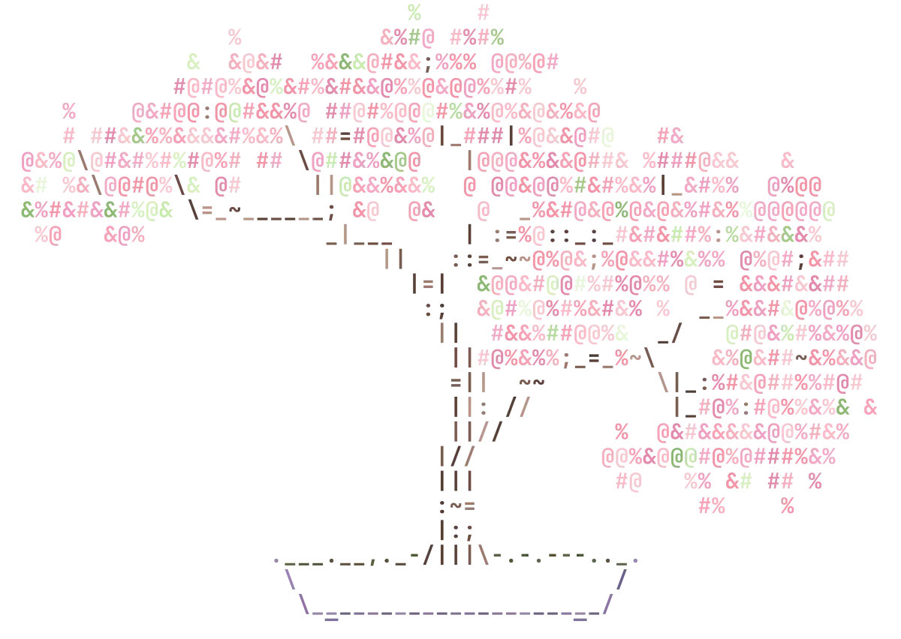

  

  

### 「 About me 」

> «Data has a memory. Models have ghosts.»

**⌬ Name**: NKTKLN  
**⌬ Focus**: Tabular ML & ML-algorithms from scratch, applied math, LLM/agentic backend engineering  
**⌬ Class**: ML Engineer  
**⌬ Location**: Moscow, Russia  

### 「 Skills 」

**⌬ Languages**: Python · SQL · Go  
**⌬ ML/AI**: scikit-learn · XGBoost · CatBoost · LightGBM · Optuna · ML algorithms from scratch · vector search (HNSW/LSH) · LLM integration · RAG · embeddings · agentic tool-calling  
**⌬ Data**: pandas · NumPy · SciPy · Matplotlib · Streamlit · web scraping (Playwright, BeautifulSoup)  
**⌬ Backend**: FastAPI · async SQLAlchemy 2.0 · Pydantic v2 · Celery  
**⌬ Storage**: PostgreSQL · Redis · MongoDB · MinIO  
**⌬ DevOps**: Docker · CI/CD · Linux · uv · ruff · pytest  

### 「 Contacts 」

- **Telegram**: [@NKTKLN_Work](https://t.me/NKTKLN_Work)
- **Email**: [nktkln.dev@gmail.com](mailto:nktkln.dev@gmail.com)

  

Thank you for visiting! 🌸

